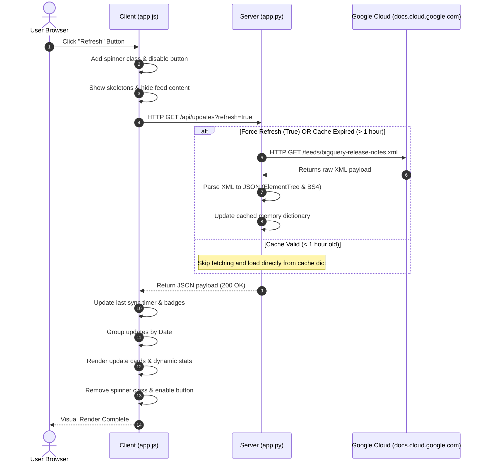
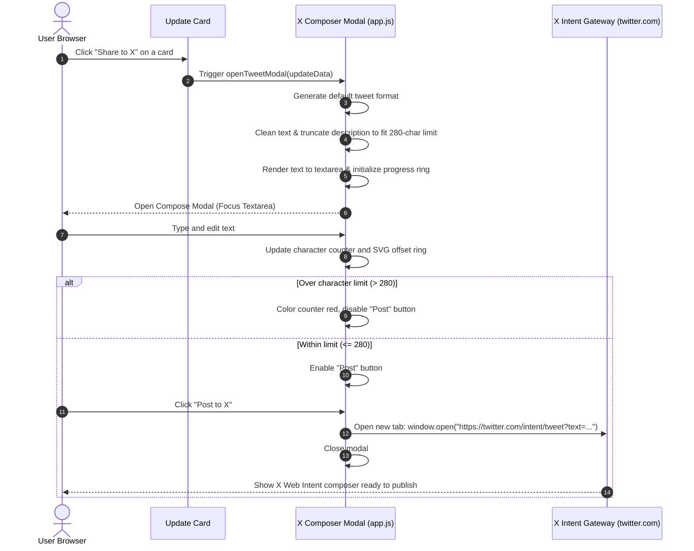

# BigQuery Release Hub - Architecture & Flow Guide

This document provides a detailed breakdown of the BigQuery Release Hub application. It is split into Core Features, Server-side Architecture, Client-side Architecture, and step-by-step Request/Response Flows.

---

## 🎯 Main Features

1. **Granular Feed Parsing**: Instead of showing a massive wall of text for a day's releases, the app parses the HTML content within each Atom entry and splits it by `<h3>` headings. This divides the feed into individual, digestible update cards categorized as *Feature*, *Announcement*, *Issue*, *Deprecated*, or *General*.
2. **Smart Caching**: The server queries the Google Cloud feed and caches the parsed updates in-memory for 1 hour to prevent hitting Google's RSS limits and to serve the frontend instantly.
3. **Manual Cache Overrides**: The client interface provides a **Refresh** button which tells the server to bypass the 1-hour cache and perform a live XML refetch.
4. **Dashboard Stats Panel**: Aggregates metadata counters (Total Updates, Features, Issues, Announcements) that load dynamically.
5. **Live Control Center**: Features real-time, client-side fuzzy searching (matches keywords in date, category, and text body) and categorization filter tabs.
6. **X (Twitter) Composer Simulation**: An interactive modal mimicking Twitter's compose window, including a circular character progress bar that turns amber/red as it approaches the 280-character limit.

---

## 🖥️ Server-Side Architecture (`app.py`)

The backend is built using **Python Flask** and acts as a lightweight proxy, data parser, and caching engine.

### Core Modules
* **`app.py`**: [File Link](file:///C:/Users/chl20/agy-cli-projects/bq-releases-notes/app.py)
* **`requirements.txt`**: [File Link](file:///C:/Users/chl20/agy-cli-projects/bq-releases-notes/requirements.txt)

### Detailed Component Breakdown

```
┌────────────────────────────────────────────────────────┐
│                        app.py                          │
├───────────────────┬────────────────────────────────────┤
│ Route: /          │ Serves static index.html           │
├───────────────────┼────────────────────────────────────┤
│ Route: /api/updates│ Handles JSON requests, cache query │
├───────────────────┼────────────────────────────────────┤
│ Cache Object      │ In-memory dict with 1-hour timeout │
├───────────────────┼────────────────────────────────────┤
│ Feed Parser       │ xml.etree & BeautifulSoup parsing  │
└───────────────────┴────────────────────────────────────┘
```

#### 1. The Caching Layer
An in-memory dictionary is used for caching:
```python
cache = {
    "updates": [],       # Array of parsed release note dictionaries
    "last_updated": 0,   # Epoch timestamp of last feed query
    "error": None        # Store errors for fallback warning banners
}
```

#### 2. Atom XML Feed Parsing
When fetching the feed, the XML namespace `http://www.w3.org/2005/Atom` must be declared to navigate the tags correctly:
* The parser finds each `<entry>` element.
* Inside each entry, the date is extracted from `<title>` (e.g., `June 17, 2026`).
* The HTML body is extracted from `<content type="html">`.
* If the HTML body contains `<h3>` tags, the script splits the text. For each `<h3>` element, it grabs all sibling nodes (like `<p>` or `<ul>`) up until the next `<h3>` tag.
* Each segment is compiled into a JSON item:
  ```json
  {
    "id": "entry_2_0",
    "date": "June 15, 2026",
    "updated": "2026-06-15T00:00:00-07:00",
    "type": "Feature",
    "description_html": "<p>Use Gemini Cloud Assist...</p>",
    "description_text": "Use Gemini Cloud Assist...",
    "link": "https://docs.cloud.google.com/bigquery/docs/release-notes#June_15_2026"
  }
  ```

---

## 📱 Client-Side Architecture (HTML, CSS, JS)

The client side is a Single Page Application (SPA) driven by vanilla browser APIs.

### Core Modules
* **HTML Structuring**: [templates/index.html](file:///C:/Users/chl20/agy-cli-projects/bq-releases-notes/templates/index.html)
* **Glassmorphic Layout & Stylings**: [static/css/style.css](file:///C:/Users/chl20/agy-cli-projects/bq-releases-notes/static/css/style.css)
* **Interactive Operations & Modals**: [static/js/app.js](file:///C:/Users/chl20/agy-cli-projects/bq-releases-notes/static/js/app.js)

### Component Details

#### 1. State Manager (`app.js`)
Keeps track of local states:
* `allUpdates`: Holds the complete master array of parsed updates received from Flask.
* `filteredUpdates`: Contains the subset of updates after search queries and tab filters are applied.
* `searchQuery`: Current input in the search bar.
* `currentFilter`: Active category type ('all', 'Feature', 'Announcement', 'Issue', 'Deprecated').

#### 2. Progress Ring Math in the Composer
The Circular Progress bar uses SVG stroke offset calculations:
* **Radius ($r$)** = 14px.
* **Circumference ($C$)** = $2 \pi r \approx 87.96$ pixels.
* Setting `stroke-dasharray` to `88 88` configures the stroke dash.
* `stroke-dashoffset` determines where the color fills. An offset of `88` is empty (0% progress), while an offset of `0` is fully closed (100% progress).
* **Offset Calculation**:
  $$\text{Offset} = C - \left(\frac{\text{Text Length}}{\text{Limit (280)}} \times C\right)$$

---

## 🔄 Request & Response Sequences

### Sequence A: Initial Load / Manual Refresh Flow

The diagram below shows what happens when a user clicks the **Refresh** button.



#### Detailed Payload Trace

**1. Request:**
* Method: `GET`
* URL: `http://127.0.0.1:5000/api/updates?refresh=true`
* Headers: `Accept: application/json`

**2. Response Payload Structure:**
```json
{
  "status": "success",
  "last_updated": 1781938920.45,
  "updates": [
    {
      "id": "entry_0_0",
      "date": "June 17, 2026",
      "updated": "2026-06-17T00:00:00-07:00",
      "type": "Feature",
      "description_html": "<p>You can enable <a href=\"...\">autonomous embedding generation</a>...</p>",
      "description_text": "You can enable autonomous embedding generation...",
      "link": "https://docs.cloud.google.com/bigquery/docs/release-notes#June_17_2026"
    }
  ]
}
```

---

### Sequence B: Drafting & Tweeting Flow


