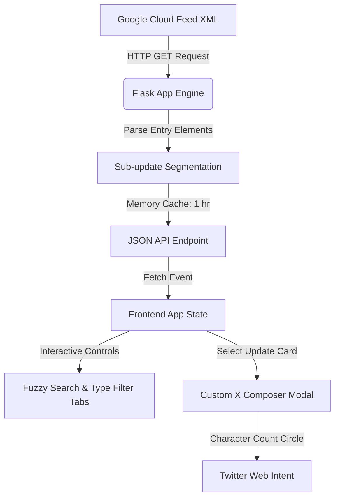

# BigQuery Release Hub - Project Summary

A premium, single-page web dashboard built with Python Flask and plain vanilla HTML, JavaScript, and CSS. The app fetches the live Google Cloud BigQuery XML feed, splits and groups updates by date, and offers filter capabilities, fuzzy keyword searches, and a custom-built Twitter/X Post Composer modal.



---

## 📁 File Structure

The project has been established in your workspace directory with the following structure:
* **Backend Flask Router & Feed Engine**: [app.py](file:///C:/Users/chl20/agy-cli-projects/bq-releases-notes/app.py)
* **Single-Page HTML Structure**: [templates/index.html](file:///C:/Users/chl20/agy-cli-projects/bq-releases-notes/templates/index.html)
* **UI Design Stylesheet (Dark & Glassmorphic)**: [static/css/style.css](file:///C:/Users/chl20/agy-cli-projects/bq-releases-notes/static/css/style.css)
* **Frontend Interactive JS Controller**: [static/js/app.js](file:///C:/Users/chl20/agy-cli-projects/bq-releases-notes/static/js/app.js)
* **Python Requirements Catalog**: [requirements.txt](file:///C:/Users/chl20/agy-cli-projects/bq-releases-notes/requirements.txt)

---

## ⚡ Key Highlights & Features

### 1. Robust Feed Parsing and Segmenting
* The backend parser inspects each daily entry of the XML feed and breaks down individual updates by parsing standard `<h3>` block nodes (e.g. splitting a single day's feed entry into distinct *Feature*, *Issue*, *Announcement*, and *Deprecated* item cards).
* Raw description HTML is preserved to format anchor links, inline code backticks, and bullet points.

### 2. In-Memory caching and dynamic sync
* To prevent rate-limiting Google's servers and ensure instant loading, feed data is cached in-memory for 1 hour.
* A floating **Refresh** button dynamically clears this cache and pulls live XML data without page reload, turning a spinning loading indicator on the interface.

### 3. Dashboard metrics widgets
* A top widget bar lists metrics summarizing update counts: *Total Updates*, *Features*, *Issues & Fixes*, and *Announcements*.
* Badges are automatically updated as items are loaded or filtered.

### 4. Advanced control panel
* **Live Search**: Instant keyword search filters the feed on titles, types, and descriptions in real-time.
* **Category Pill Tabs**: Quick-filter feed cards by category (Features, Issues, Announcements, Deprecated, General) with category counts.

### 5. Custom Twitter/X Composer Modal
* Clicking **Share to X** on any card opens a custom-designed dark composer that looks like a real Twitter compose card.
* **Auto-Drafting**: Generates a standard formatted draft layout:
  `📢 BigQuery Update (June 17, 2026) • Feature: Description... 🔗 Link #BigQuery #GCP`
* **Real-time character ring limits**: Features a circular progress ring matching X's native composer. The circle fills up as the user types, warning in amber at 20 characters remaining, and turning red/blocking submissions when going over the 280-character limit.
* Clicking **Post to X** fires a web intent window mapping the edited string.

---

## ⚙️ Running Locally

1. **Install Dependencies** (from the workspace root):
   ```powershell
   pip install -r requirements.txt
   ```
2. **Start Server**:
   ```powershell
   python app.py
   ```
3. **Visit Hub**: Open your browser at [http://127.0.0.1:5000](http://127.0.0.1:5000)
